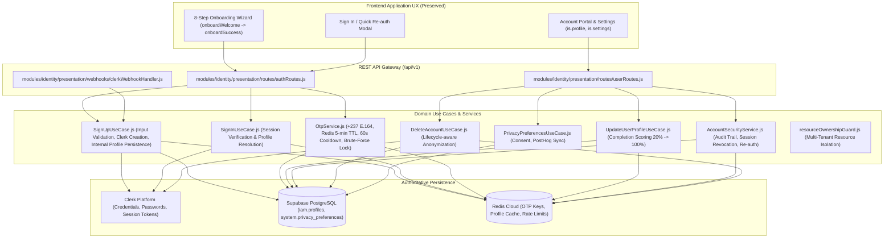

# LOUMOO — Authentication & Identity Architecture (Prompt 02)

## 1. Domain Overview (02.01 – 02.14)

The Authentication & Identity domain establishes a clear separation of concerns between:
- **Authentication Credentials Authority**: Clerk IAM (credentials, multi-factor, session management, OAuth, token signing).
- **Application Domain Authority**: Supabase PostgreSQL (`iam.profiles`, `iam.roles`, `iam.user_roles`, `system.privacy_preferences`, `system.account_security_events`).
- **Security & Ephemeral Coordination**: Redis Cloud (OTP hashes, 60s cooldown locks, 5-minute TTL, profile caching, rate limits).

---

## 2. Component Topology & Separation of Concerns

---

## 3. Detailed Specification Breakdown

### 02.01 Authentication Architecture
- Separation between external credentials in Clerk and internal UUID profile in `iam.profiles`.
- Single source of truth for relationships: foreign keys across orders, cart, listings point to internal UUID `iam.profiles.id`, not raw Clerk strings.

### 02.02 Sign Up
- `POST /api/v1/auth/signup`:
  - Validates `email`, `phoneNumber`, `firstName`, `lastName`, `city`, `intent` (`buyer` | `seller` | `both`).
  - Strict rule: Public registration assigns only `customer` or `seller` role (never `admin`, `super_admin`, or `moderator`).
  - Emits `USER_CREATED` outbox event and tracks `auth_signup_completed` in PostHog.
  - Sends transactional welcome email via Resend.

### 02.03 Sign In
- `POST /api/v1/auth/signin`:
  - Resolves internal profile from Redis cache (600s TTL) or database.
  - Enforces account status checks: blocks `suspended` and `anonymized` accounts.
  - Updates `last_login_at` and returns UserProfile and RBAC permissions.

### 02.04 Logout
- `POST /api/v1/auth/logout`:
  - Terminates active session and invalidates client credentials.

### 02.05 Password Reset
- `POST /api/v1/auth/password-reset/request` & `POST /api/v1/auth/password-reset/confirm`:
  - Uniform responses to minimize user enumeration.
  - Delegated to Clerk recovery token engine.

### 02.06 Email Verification
- `POST /api/v1/auth/email/verify`:
  - Marks email as verified.

### 02.07 Phone Verification & OTP
- `POST /api/v1/auth/otp/send` & `POST /api/v1/auth/otp/verify`:
  - Cameroon E.164 normalization (`+237 6xx xx xx xx`).
  - Sliding-window rate limit: max 3 requests per 5 minutes.
  - Resend cooldown: 60 seconds.
  - Brute-force protection: 3 attempts before OTP invalidation.
  - Upon success, marks `is_phone_verified: true`.

### 02.08 Session Management & 02.12 Account Security
- `GET /api/v1/users/me/sessions`: Lists active sessions.
- `DELETE /api/v1/users/me/sessions/:sessionId`: Remotely revokes session.
- `assertRecentAuthentication()`: Re-authentication challenge for sensitive mutations.
- `system.account_security_events`: Immutable security audit log.

### 02.09 User Profiles & Dynamic Completion Scoring
- Dynamic completion scoring formula:
  - Base account (names + email): +20%
  - Phone verified: +20%
  - City / location: +15%
  - Buyer/Seller preferences: +15%
  - KYC doc verified: +15%
  - Avatar / RCCM: +15%
  - Max score: 100%.

### 02.10 Buyer & Seller Permissions & Resource Ownership
- `requireResourceOwner()` middleware enforces multi-tenant isolation:
  - Seller A cannot view, update, or delete Seller B's storefront, products, or private orders.
  - Buyer A cannot access Buyer B's cart or orders.
  - Admin role has platform-wide authority.

### 02.11 Role-Based Access Control (RBAC)
- 6-tier hierarchy: `customer` (1) < `seller` (2) = `seller_staff` (2) < `moderator` (3) < `admin` (4) < `super_admin` (5).

### 02.13 Account Deletion (Lifecycle-Aware)
- `DELETE /api/v1/users/me`:
  - Requires explicit confirmation (`confirmText: 'DELETE'`).
  - Transitions `account_status: 'anonymized'`.
  - Redacts PII (`first_name`, `last_name`, `email`, `phone_number`, `avatar_url`).
  - Preserves immutable financial ledger records for regulatory compliance.

### 02.14 Privacy Controls
- `GET /api/v1/users/me/privacy` & `PATCH /api/v1/users/me/privacy`:
  - Manages `analyticsConsent`, `marketingEmails`, `personalizedRecommendations`, and `profileVisibility`.
  - Syncs opt-in/opt-out with PostHog telemetry.

---

## 4. REST API Endpoint Roster

| Method | Endpoint | Auth | Purpose |
| :--- | :--- | :--- | :--- |
| `POST` | `/api/v1/auth/signup` | Public | Validated user registration (Buyer/Seller) |
| `POST` | `/api/v1/auth/signin` | Public | Credentials / token authentication |
| `POST` | `/api/v1/auth/logout` | Public/Bearer | Session termination |
| `POST` | `/api/v1/auth/otp/send` | Public/Bearer | Rate-limited +237 OTP generation |
| `POST` | `/api/v1/auth/otp/verify` | Public/Bearer | OTP code verification with 3-strike lock |
| `POST` | `/api/v1/auth/password-reset/request` | Public | Rate-limited recovery request |
| `POST` | `/api/v1/auth/password-reset/confirm` | Public | Confirm password recovery |
| `POST` | `/api/v1/auth/email/verify` | Public/Bearer | Email verification |
| `GET` | `/api/v1/users/me` | Bearer | Current user profile & completion stats |
| `PATCH` | `/api/v1/users/me` | Bearer | Update profile details |
| `GET` | `/api/v1/users/me/sessions` | Bearer | List active sessions |
| `DELETE` | `/api/v1/users/me/sessions/:sessionId` | Bearer | Revoke remote session |
| `GET` | `/api/v1/users/me/privacy` | Bearer | Get privacy preferences |
| `PATCH` | `/api/v1/users/me/privacy` | Bearer | Update privacy preferences |
| `DELETE` | `/api/v1/users/me` | Bearer | Lifecycle-aware account deletion |
| `GET` | `/api/v1/users/:userId/public` | Public | Public sanitized merchant card |

---

## 5. Test Suite Verification Results (`17/17 Passed`)

- **Foundation Suites (9)**: All 9 passed (100%).
- **Prompt 02 Auth & Identity Suites (8)**:
  - `Sign Up & Sign In (02.02, 02.03)`: Passed.
  - `Phone & OTP Verification (02.07)`: Passed.
  - `User Profiles & Completion Scoring (02.09)`: Passed.
  - `Buyer/Seller Permissions & Isolation (02.10, 02.11)`: Passed.
  - `Account Security & Sessions (02.08, 02.12)`: Passed.
  - `Account Deletion & Anonymization (02.13)`: Passed.
  - `Privacy Preferences & Consent (02.14)`: Passed.
  - `Auth & Identity REST Endpoints Pipeline`: Passed.
- **Frontend Screen & State Verification**:
  - `python verify_screens.py`: 58/58 screens intact.
  - `node verify_runtime.js`: 100% clean runtime test passes.
