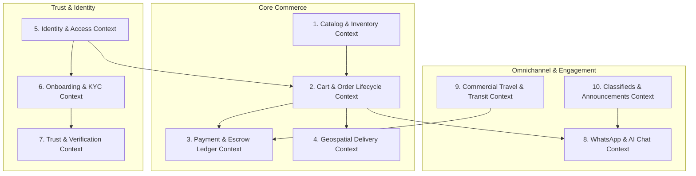

# LOUMOO — Master Domain Model & Bounded Contexts

## 1. Domain-Driven Design (DDD) Bounded Contexts

LOUMOO is decomposed into **10 well-defined Bounded Contexts**, each maintaining strict domain autonomy, rich domain aggregates, explicit business invariants, and domain events.

---

## 2. Detailed Bounded Context Specifications

### Context 1: Identity & Access Management (IAM)
- **Root Aggregate**: `User`
- **Entities**: `UserCredentials`, `Session`, `UserRole`, `Permission`, `DeviceFingerprint`
- **Value Objects**: `UserId`, `PhoneNumber` (+237 validation), `EmailAddress`, `HashedPassword`, `AuthToken`
- **Domain Invariants**:
  - A user's phone number must be unique across active accounts.
  - A session is invalid if revoked, expired, or initiated from a blacklisted device fingerprint.
  - Password hashes must use Argon2id with work factor >= 3.
- **Domain Events**: `UserRegisteredEvent`, `UserLoggedInEvent`, `SessionRevokedEvent`, `PasswordResetRequestedEvent`.

---

### Context 2: Onboarding & KYC Bounded Context
- **Root Aggregate**: `OnboardingSession`
- **Entities**: `OnboardingStep`, `QuestionResponse`, `BuyerPreferences`, `SellerProfileDraft`
- **Value Objects**: 
  - `UserIntent` (`BUYER`, `SELLER`, `BOTH`)
  - `SellerType` (`INDIVIDUAL`, `PROFESSIONAL_BOUTIQUE`, `SERVICE_PROVIDER`)
  - `LegalForm` (`SARL`, `SOLE_PROPRIETORSHIP`, `SA`, `COOPERATIVE`)
  - `CatalogVolumeTier` (`TIER_1_10`, `TIER_11_50`, `TIER_50_200`, `TIER_200_PLUS`)
  - `CompletionPercentage` (computed float 0.0 - 100.0)
- **Domain Invariants**:
  - Buyers must never be presented with mandatory seller tax or business registration questions.
  - Sellers must complete Legal Form and Business Name before transitioning to `VERIFICATION_READY`.
  - Onboarding progress is saved incrementally after each screen transition and can be resumed across devices.
- **Domain Events**: `OnboardingStepCompletedEvent`, `OnboardingFinalizedEvent`, `SellerProfileDraftCreatedEvent`.

---

### Context 3: Omnichannel Catalog & Inventory
- **Root Aggregate**: `Product`
- **Entities**: `ProductVariant`, `ProductSpecification`, `ProductMedia`, `InventoryItem`, `StockMovement`
- **Value Objects**: 
  - `Money` (Currency `XAF`, Amount as integer minor units)
  - `ProductCondition` (`NEW`, `REFURBISHED`, `USED_GOOD`, `USED_FAIR`)
  - `CommercialVertical` (`PHYSICAL_GOODS`, `HOSPITALITY`, `TRAVEL`, `SERVICES`, `EDUCATION`, `CLASSIFIED`)
  - `SKU` (`LOUMOO-CAT-MERCH-VAR`)
  - `GeoLocation` (Latitude, Longitude, Altitude, Physical Address)
- **Domain Invariants**:
  - `AvailableStock` = `TotalStock` - `ReservedStock`. Available stock cannot be negative.
  - A product cannot be published without at least 1 verified media item and an active pricing tier.
  - Black FreeDay promotional prices must be lower than the historical 30-day minimum price.
- **Domain Events**: `ProductCreatedEvent`, `ProductPublishedEvent`, `ProductPriceChangedEvent`, `StockReservedEvent`, `StockDepletedEvent`.

---

### Context 4: Cart & Order Commerce Lifecycle
- **Root Aggregate**: `Order`
- **Entities**: `OrderItem`, `Cart`, `CartItem`, `OrderTimelineEntry`, `ShippingAllocation`
- **Value Objects**: 
  - `OrderId` (`KM-YYYY-XXXXXX`)
  - `OrderStatus` (`DRAFT`, `PENDING_PAYMENT`, `PAYMENT_CONFIRMED`, `PROCESSING`, `SHIPPED`, `DELIVERED`, `COMPLETED`, `CANCELLED`, `REFUNDED`)
  - `DeliveryOption` (`HOME_DELIVERY`, `STORE_PICKUP`, `NATIONWIDE_EXPRESS`)
  - `TrackingNumber`
- **Domain Invariants**:
  - Order creation atomically locks inventory for all line items for 15 minutes pending mobile money approval.
  - An order with items from multiple independent sellers is automatically split into distinct `SellerFulfillmentOrders` with individual tracking and payout allocations.
  - Price of items in cart is validated against live catalog at the exact moment of checkout intent creation.
- **Domain Events**: `CartItemAddedEvent`, `OrderCreatedEvent`, `OrderStatusChangedEvent`, `OrderCancelledEvent`, `OrderDeliveredEvent`.

---

### Context 5: Payment, Escrow & General Ledger
- **Root Aggregate**: `PaymentIntent`
- **Entities**: `PaymentTransaction`, `EscrowContract`, `LedgerAccount`, `LedgerJournalEntry`, `SellerPayout`
- **Value Objects**: 
  - `PaymentMethod` (`MTN_MOMO`, `ORANGE_MONEY`, `CREDIT_CARD`, `LOUMOO_WALLET`)
  - `EscrowStatus` (`HELD_IN_TRUST`, `RELEASE_SCHEDULED`, `DISBURSED_TO_SELLER`, `REFUNDED_TO_BUYER`, `DISPUTED`)
  - `CommissionRate` (Platform % + Fixed fee)
- **Domain Invariants**:
  - **Double-Entry Balance Equation**: For every journal entry: $\sum \text{Debits} = \sum \text{Credits}$ must strictly equal zero.
  - Seller payout funds remain in `HELD_IN_TRUST` until buyer confirms delivery or 48 hours elapse without dispute post-carrier delivery confirmation.
  - External payment gateway webhook notifications must be processed with strict idempotency based on `IdempotencyKey` + `GatewayReference`.
- **Domain Events**: `PaymentInitiatedEvent`, `PaymentCapturedEvent`, `PaymentFailedEvent`, `EscrowDisbursedEvent`, `RefundProcessedEvent`.

---

### Context 6: WhatsApp Messaging & AI Commerce Concierge
- **Root Aggregate**: `Conversation`
- **Entities**: `ChatMessage`, `VoiceNoteWaveform`, `MessageAttachment`, `AiContextMemory`
- **Value Objects**: 
  - `MessageType` (`TEXT`, `VOICE_NOTE`, `CONTACT_CARD`, `PRODUCT_SNIPPET`, `ORDER_UPDATE`, `SYSTEM_NOTICE`)
  - `DeliveryStatus` (`SENT`, `DELIVERED`, `READ`)
  - `AudioWaveform` (Array of normalized amplitude integers 0-100)
- **Domain Invariants**:
  - Voice notes are restricted to max 5 minutes and 10 MB payload, with auto-generated waveform arrays.
  - TchueKAM AI assistant conversations maintain a sliding window of recent conversation turns and pull live product availability from Meilisearch.
- **Domain Events**: `MessageSentEvent`, `MessageReadEvent`, `VoiceNoteProcessedEvent`, `AiRecommendationGeneratedEvent`.

---

### Context 7: Trust, Verification & KYC Hub
- **Root Aggregate**: `VerificationCase`
- **Entities**: `VerificationDocument`, `VerificationReviewNote`, `ComplianceAuditEntry`
- **Value Objects**: 
  - `VerificationStatus` (`NOT_STARTED`, `IN_PROGRESS`, `PENDING_REVIEW`, `VERIFIED`, `REJECTED`, `EXPIRED`)
  - `DocumentType` (`NATIONAL_ID_CNI`, `PASSPORT`, `RCCM_REGISTRATION`, `TAXPAYER_CARD_NIU`, `UTILITY_BILL`)
- **Domain Invariants**:
  - Verification documents are stored in private encrypted S3 buckets accessible only via signed URLs to accredited compliance agents.
  - A verified seller badge (`✓ Verified`) is revoked automatically if an RCCM or CNI document reaches expiration without renewal.
- **Domain Events**: `VerificationDocumentUploadedEvent`, `VerificationApprovedEvent`, `VerificationRejectedEvent`.

---

### Context 8: Commercial Travel & Transit
- **Root Aggregate**: `TravelReservation`
- **Entities**: `FlightItinerary`, `FlightSegment`, `BusTripLine`, `VacationPackageBooking`, `PassengerDetail`, `BoardingPassTicket`
- **Value Objects**: 
  - `AirportCode` (`DLA`, `NSI`, `CDG`, `BRU`)
  - `TransitType` (`COMMERCIAL_FLIGHT`, `VIP_INTERCITY_BUS`, `EXCURSION_PACKAGE`, `VISA_CONCIERGE`)
  - `PNR` (Passenger Name Record 6-character alphanumeric)
  - `SeatNumber`
- **Domain Invariants**:
  - Seat availability is checked in real time against airline GDS or intercity bus fleet inventory.
  - Boarding pass generation produces a valid Apple Wallet PKPass bundle with signed SHA-256 manifest and QR code.
- **Domain Events**: `FlightSeatsReservedEvent`, `BoardingPassIssuedEvent`, `TripCancelledEvent`.

---

### Context 9: Geospatial Delivery & Fulfillment
- **Root Aggregate**: `DeliveryShipment`
- **Entities**: `DeliveryZone`, `CourierAllocation`, `FulfillmentHub`, `ProofOfDelivery`
- **Value Objects**: 
  - `PolygonZone` (PostGIS spatial geometry)
  - `EstimatedArrivalWindow` (e.g. "Same-day before 17:00 in Douala")
  - `DeliveryFeeCalculation` (Base fee + Distance km rate + Weight multiplier)
- **Domain Invariants**:
  - Home delivery is only enabled if buyer coordinates fall within the seller's active `DeliveryZone`.
  - Store pickup requires seller confirmation of ready-for-pickup package before buyer PIN verification.
- **Domain Events**: `ShipmentDispatchedEvent`, `CourierAssignedEvent`, `DeliveryCompletedEvent`.

---

### Context 10: Community Classifieds & Announcements
- **Root Aggregate**: `AnnouncementPost`
- **Entities**: `JobPostingDetail`, `TenderProposal`, `EventListing`, `ApplicantSubmission`
- **Value Objects**: 
  - `AnnouncementCategory` (`SERVICES`, `COMMERCIAL_OFFERS`, `JOBS`, `EVENTS`, `PUBLIC_TENDERS`)
  - `SalaryCompensation` (Fixed XAF, Range, or Quote on Request)
- **Domain Invariants**:
  - Announcements undergo automated profanity, fraud, and duplicate listing moderation before public broadcast.
  - Applications link directly to verified applicant LOUMOO profile.
- **Domain Events**: `AnnouncementPostedEvent`, `JobApplicationSubmittedEvent`.
