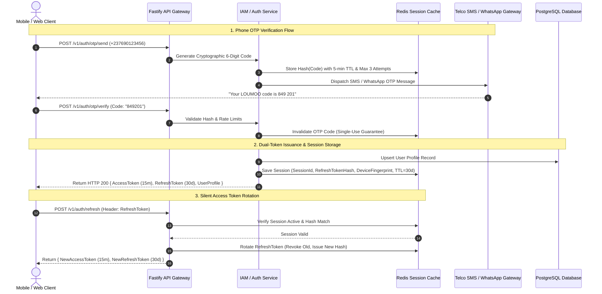
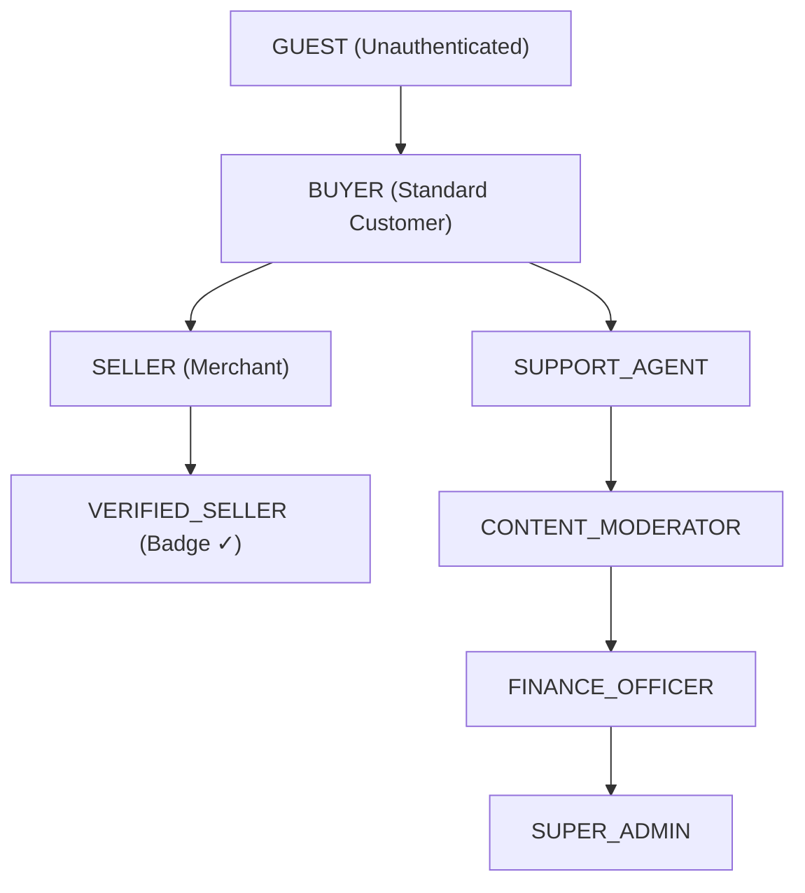

# LOUMOO — Authentication, Authorization & Security Architecture

## 1. Authentication & Session Architecture

LOUMOO implements a **zero-trust, dual-token cryptographic session architecture** optimized for mobile environments where network connectivity may fluctuate across Cameroon.



---

## 2. Token Specifications & Cryptographic Signatures

### 2.1 Access Token (JWT - Stateless, Short-Lived)
- **Algorithm**: `Ed25519` (EdDSA) or `RS256` (Asymmetric public/private key pair).
- **Lifespan**: **15 minutes**.
- **Payload Schema**:
```json
{
  "iss": "https://api.loumoo.cm",
  "sub": "usr_9b1deb4d-3b7d-4bad-9bdd-2b0d7b3dcb6d",
  "aud": "loumoo-clients",
  "jti": "jwt_d82f710a-84cb-4d7a-89a1-8d2b78129e01",
  "role": "VERIFIED_SELLER",
  "sellerId": "sel_orca_electronics",
  "permissions": [
    "product:create", "product:update", "order:read", "payout:request", "chat:read_write"
  ],
  "isPhoneVerified": true,
  "iat": 1788105600,
  "exp": 1788106500
}
```

### 2.2 Refresh Token (Opaque, Statefully Managed in Redis)
- **Format**: 256-bit cryptographically secure pseudorandom string (`crypto.randomBytes(32).toString('hex')`).
- **Lifespan**: **30 days** (Sliding expiration refreshed on usage).
- **Storage**: Only the SHA-256 hash is stored in Redis.
- **Revocation**: A user logging out immediately deletes the session key from Redis, instantly invalidating the refresh token.

---

## 3. Role-Based & Attribute-Based Access Control (RBAC / ABAC)

LOUMOO enforces strict multi-tenant authorization. Route guards inspect user roles, permissions, and entity ownership before executing business logic.

### 3.1 Role Hierarchy Matrix



### 3.2 Permission Enforcement Matrix

| Domain Resource | Permission | Guest | Buyer | Seller | Verified Seller | Support | Admin |
| :--- | :--- | :---: | :---: | :---: | :---: | :---: | :---: |
| **Catalog** | `product:view` | ✅ | ✅ | ✅ | ✅ | ✅ | ✅ |
| **Catalog** | `product:create` | ❌ | ❌ | ✅ | ✅ | ❌ | ✅ |
| **Catalog** | `product:publish_freeday` | ❌ | ❌ | ❌ | ✅ | ❌ | ✅ |
| **Commerce** | `order:create` | ❌ | ✅ | ✅ | ✅ | ❌ | ❌ |
| **Commerce** | `order:view_own` | ❌ | ✅ (Own) | ✅ (Own) | ✅ (Own) | ✅ | ✅ |
| **Commerce** | `order:manage_fulfillment` | ❌ | ❌ | ✅ (Own store) | ✅ (Own store) | ✅ | ✅ |
| **Payments** | `payout:request` | ❌ | ❌ | ✅ (Own balance)| ✅ (Own balance)| ❌ | ✅ |
| **Payments** | `ledger:view_audit` | ❌ | ❌ | ❌ | ❌ | ❌ | ✅ |
| **Verification** | `kyc:review_documents` | ❌ | ❌ | ❌ | ❌ | ❌ | ✅ |
| **Users** | `user:suspend` | ❌ | ❌ | ❌ | ❌ | ❌ | ✅ |

### 3.3 Multi-Tenant ABAC Tenant Isolation Rule
No merchant can inspect, edit, or fulfill an order item belonging to another merchant:
```typescript
// ABAC Policy Guard
if (orderItem.sellerId !== authenticatedUser.sellerId && !authenticatedUser.hasRole('ADMIN')) {
  throw new ForbiddenException('ERR_FORBIDDEN_RESOURCE_TENANT_MISMATCH');
}
```

---

## 4. Platform Security Controls & Defenses

### 4.1 PII Protection & Data Encryption at Rest
- **Database Column Encryption**: Sensitive government IDs (CNI number, Passport, Tax NIU) are encrypted before insertion using AES-256-GCM via `pgcrypto` or application-layer KMS keys.
- **Passkeys & Passwords**: Argon2id (`t=3, m=65536, p=4`) with unique per-user cryptographically random salts.

### 4.2 Rate Limiting & Brute-Force Prevention
- **Global Ingress Limit**: 100 requests per second per IP (Cloudflare + Envoy).
- **OTP Endpoint Limit**: 3 OTP generation requests per phone number per 5 minutes.
- **Login Brute-Force Shield**: Account is locked for 15 minutes after 5 consecutive failed password attempts.

### 4.3 Content Security, CSRF & XSS Safeguards
- **HTTP Headers**:
  ```http
  Strict-Transport-Security: max-age=63072000; includeSubDomains; preload
  X-Content-Type-Options: nosniff
  X-Frame-Options: DENY
  Content-Security-Policy: default-src 'self'; img-src 'self' https://cdn.loumoo.cm data:; connect-src 'self' wss://ws.loumoo.cm https://api.loumoo.cm;
  ```
- **Input Sanitization**: All HTML descriptions and announcement content are sanitized with DOMPurify / sanitize-html on the backend before storage.
