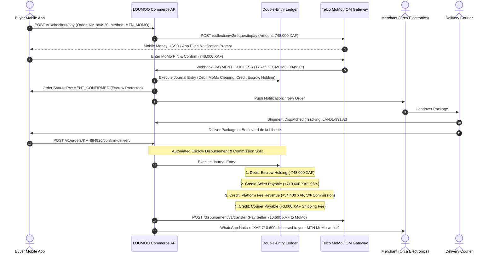

# LOUMOO — Master Payments, Escrow & Double-Entry Ledger Architecture

## 1. Executive Payments Overview

LOUMOO's commercial architecture operates on a **Managed Escrow Marketplace Model**. The platform acts as a trusted escrow intermediary between buyers and sellers in the CEMAC region, accepting **MTN Mobile Money (MoMo)**, **Orange Money (OM)**, and **Credit/Debit Cards (Visa/Mastercard)** in Central African CFA Francs (XAF).

Funds are **never paid directly to sellers upfront**. Instead, funds are captured into a segregated **Escrow Clearing Account** and only released to the seller's mobile money wallet upon verified buyer delivery confirmation or expiration of the 48-hour inspection period.

---

## 2. End-to-End Escrow Payment Lifecycle



---

## 3. Double-Entry Accounting General Ledger

To guarantee 100% financial correctness, LOUMOO strictly prohibits deriving account balances from mutable order records. All monetary events are recorded as **immutable, balanced double-entry journal entries**.

$$\sum \text{Debits} \equiv \sum \text{Credits}$$

### 3.1 Chart of Accounts (COA)

| Account Number | Account Name | Account Type | Normal Balance | Purpose |
| :--- | :--- | :--- | :--- | :--- |
| `1010` | `MOMO_CLEARING_MTN` | Asset | Debit | Undisbursed funds held at MTN Mobile Money |
| `1020` | `OM_CLEARING_ORANGE` | Asset | Debit | Undisbursed funds held at Orange Money |
| `1030` | `BANK_CLEARING_CARDS` | Asset | Debit | Card processing settlement account |
| `2010` | `CUSTOMER_ESCROW_LIABILITY` | Liability | Credit | Funds held in trust for buyers pending delivery |
| `2020` | `SELLER_PAYABLES` | Liability | Credit | Earnings owed to verified merchants |
| `2030` | `COURIER_PAYABLES` | Liability | Credit | Delivery fees owed to local logistics partners |
| `4010` | `PLATFORM_COMMISSION_REVENUE` | Revenue | Credit | Marketplace percentage take rate (3% - 8%) |
| `5010` | `TELCO_PROCESSING_FEES` | Expense | Debit | Inbound gateway fees (approx 1.5% - 2%) |

### 3.2 Standard Journal Entry Exemplars

#### Example A: Buyer Pays XAF 748 000 via MTN MoMo
```sql
-- Transaction Reference: TX-MOMO-884920
INSERT INTO ledger.journal_entries (transaction_reference, description, related_order_id)
VALUES ('TX-MOMO-884920', 'Customer payment for Order KM-884920 via MTN MoMo', 'order-uuid');

-- Entry Lines (Debits = Credits = 748,000 XAF)
INSERT INTO ledger.entry_lines (journal_entry_id, account_id, debit_amount_xaf, credit_amount_xaf) VALUES
('je-uuid', 'acc-1010-momo-clearing', 748000, 0),       -- Debit Asset (Cash Received)
('je-uuid', 'acc-2010-escrow-liability', 0, 748000);     -- Credit Liability (Held in Trust)
```

#### Example B: Order Delivered & Escrow Released (5% Platform Commission)
```sql
-- Total: 748,000 XAF (Product: 745,000 + Shipping: 3,000)
-- Seller Earnings: 745,000 * 0.95 = 707,750 XAF
-- Platform Commission: 745,000 * 0.05 = 37,250 XAF
-- Courier Delivery Fee: 3,000 XAF

INSERT INTO ledger.entry_lines (journal_entry_id, account_id, debit_amount_xaf, credit_amount_xaf) VALUES
('je-uuid-release', 'acc-2010-escrow-liability', 748000, 0),       -- Debit Liability (Release Escrow)
('je-uuid-release', 'acc-2020-seller-payables', 0, 707750),        -- Credit Liability (Owed to Seller)
('je-uuid-release', 'acc-4010-platform-revenue', 0, 37250),        -- Credit Revenue (Platform Fee)
('je-uuid-release', 'acc-2030-courier-payables', 0, 3000);         -- Credit Liability (Owed to Courier)
```

---

## 4. Regional Telco Payment Gateway Integrations

### 4.1 MTN Mobile Money (MoMo API v2.0 Collections)
- **Authentication**: API User UUID + API Key exchanging for short-lived OAuth 2.0 Bearer tokens.
- **Push Prompt Endpoint**: `POST /collection/v2_0/requesttopay`
- **Headers**:
  - `X-Reference-Id`: UUIDv4 transaction identifier
  - `X-Target-Environment`: `live`
  - `Ocp-Apim-Subscription-Key`: Secret subscription key
- **Webhook Signature Verification**: HMAC-SHA256 signature checked against `X-Callback-Signature`.

### 4.2 Orange Money (OM Web Payment / e-Commerce API)
- **Token Request**: Basic Auth (ClientID:ClientSecret) -> Access Token.
- **Payment Request**: `POST /orange-money-webpay/cm/v1/webpayment`
- **Polling & Webhook**: Receives `STATUS_SUCCESS` callback with digital token verification.

---

## 5. Webhook Idempotency & Concurrency Guarantees

All payment webhook listeners execute inside an **isolated PostgreSQL SERIALIZABLE transaction** guarded by a **Redis Distributed Lock**:

```typescript
async function processPaymentWebhook(payload: MoMoWebhookPayload): Promise<void> {
  const lockKey = `lock:payment:${payload.transactionReference}`;
  const acquired = await redis.set(lockKey, 'locked', 'NX', 'EX', 30);
  
  if (!acquired) {
    logger.warn(`Duplicate webhook processing attempt ignored for ${payload.transactionReference}`);
    return;
  }

  try {
    await prisma.$transaction(async (tx) => {
      // 1. Check idempotency: Has this transaction already been posted?
      const existing = await tx.journalEntry.findUnique({
        where: { transactionReference: payload.transactionReference }
      });
      if (existing) return; // Idempotent exit

      // 2. Post balanced ledger entries
      await recordDoubleEntryPayment(tx, payload);

      // 3. Transition Order Status to PAYMENT_CONFIRMED
      await tx.order.update({
        where: { id: payload.orderId },
        data: { status: 'PAYMENT_CONFIRMED', escrowStatus: 'HELD_IN_TRUST' }
      });

      // 4. Emit PaymentCapturedEvent for downstream notifications
      await outbox.emit('PAYMENT_CAPTURED', { orderId: payload.orderId });
    }, { isolationLevel: 'Serializable' });
  } finally {
    await redis.del(lockKey);
  }
}
```
