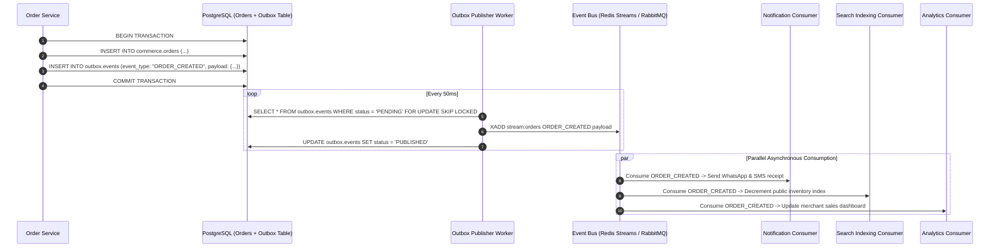

# LOUMOO — Master Event-Driven Architecture & Domain Events Specification

## 1. Event-Driven Architecture Overview

LOUMOO utilizes an **Event-Driven Architecture (EDA)** with the **Transactional Outbox Pattern** to asynchronously decouple domain boundaries without introducing distributed dual-write inconsistencies.

When a transactional operation occurs (e.g. creating an order or verifying a seller), the business data update and the domain event payload are written atomically to PostgreSQL in the **same local database transaction**. A dedicated background worker process reads from the `outbox_events` table and publishes the event to the **Redis Streams / RabbitMQ Event Bus**.



---

## 2. Standardized CloudEvents 1.0 Envelope

All domain events strictly adhere to the **CloudEvents v1.0 specification**:

```json
{
  "specversion": "1.0",
  "id": "evt_7f8a9b1c-3d2e-4f5a-8b9c-0d1e2f3a4b5c",
  "source": "https://api.loumoo.cm/services/commerce",
  "type": "cm.loumoo.commerce.order.created.v1",
  "datacontenttype": "application/json",
  "time": "2026-08-30T16:42:00.000Z",
  "subject": "order_KM-884920",
  "data": {
    "orderNumber": "KM-884920",
    "buyerId": "usr_9b1deb4d-3b7d-4bad-9bdd-2b0d7b3dcb6d",
    "totalAmountXaf": 748000,
    "items": [
      {
        "productId": "prod-macbook-air-m2",
        "variantId": "var-256-grey",
        "sellerId": "sel_orca_electronics",
        "unitPriceXaf": 745000,
        "quantity": 1
      }
    ],
    "deliveryMethod": "HOME_DELIVERY",
    "deliveryCity": "Douala"
  }
}
```

---

## 3. Comprehensive Domain Event Registry Matrix

| Domain Event Type | Producer | Triggering Action | Consumers & Asynchronous Side Effects | Retry / DLQ Policy |
| :--- | :--- | :--- | :--- | :--- |
| `iam.user.registered.v1` | Auth Module | User finishes OTP verification & basic registration | Send Welcome WhatsApp; Create default Wishlist; Initialize analytics profile | Max 5 retries, backoff: 2s, 4s, 8s, 16s, 32s -> DLQ |
| `onboarding.completed.v1` | Onboarding | User completes 8-stage onboarding wizard | Update User completion score (85%); Activate seller studio if seller intent; Trigger welcome voucher | Max 5 retries -> DLQ |
| `seller.verified.v1` | Trust Hub | Compliance officer approves CNI / RCCM documents | Grant `✓ Verified` badge; Enable Black FreeDay deal publishing; Notify merchant via SMS | Max 3 retries -> DLQ |
| `catalog.product.created.v1`| Catalog | Merchant submits a new listing | Reindex product in Meilisearch; Warm CDN cache; Notify store followers | Max 5 retries -> DLQ |
| `catalog.stock.depleted.v1`| Catalog | Stock falls to 0 after order confirmation | Mark listing as `Out of Stock` in Meilisearch; Notify merchant to restock | Max 3 retries -> DLQ |
| `commerce.order.created.v1`| Commerce | Buyer submits checkout intent | Reserve stock; Lock inventory for 15 minutes; Generate payment intent | Max 5 retries -> DLQ |
| `payments.payment.captured.v1`| Payments | MoMo / OM webhook confirms fund receipt | Post double-entry ledger entry; Update Order to `PAYMENT_CONFIRMED`; Send WhatsApp receipt to buyer; Alert seller | Max 10 retries -> Critical Alert |
| `payments.escrow.disbursed.v1`| Payments | Buyer confirms delivery or 48h timer expires | Release funds from Escrow Holding to Seller Payable; Trigger MoMo disbursement transfer | Max 5 retries -> Critical Alert |
| `messaging.message.sent.v1`| Messaging | Buyer or merchant sends chat message | Broadcast via WebSocket to active clients; Send push notification if recipient offline | Max 3 retries -> DLQ |
| `travel.booking.confirmed.v1`| Travel | Flight / Bus booking payment confirmed | Issue PNR; Generate Apple Wallet PKPass; Send e-ticket PDF via email & WhatsApp | Max 5 retries -> DLQ |
| `community.announcement.posted.v1`| Community | New job / tender / service posted | Run automated text moderation; Index in Meilisearch; Broadcast to city channel | Max 3 retries -> DLQ |

---

## 4. Transactional Outbox Implementation in PostgreSQL

```sql
CREATE SCHEMA IF NOT EXISTS outbox;

CREATE TABLE outbox.events (
    id UUID PRIMARY KEY DEFAULT uuid_generate_v4(),
    aggregate_type VARCHAR(100) NOT NULL,              -- e.g. "Order", "Product", "Payment"
    aggregate_id VARCHAR(100) NOT NULL,
    event_type VARCHAR(150) NOT NULL,                 -- e.g. "cm.loumoo.commerce.order.created.v1"
    payload JSONB NOT NULL,
    status VARCHAR(30) NOT NULL DEFAULT 'PENDING',     -- 'PENDING', 'PUBLISHED', 'FAILED'
    retry_count INT NOT NULL DEFAULT 0,
    error_detail TEXT,
    created_at TIMESTAMPTZ NOT NULL DEFAULT NOW(),
    published_at TIMESTAMPTZ
);

CREATE INDEX idx_outbox_pending ON outbox.events(created_at) WHERE status = 'PENDING';
```

---

## 5. Dead-Letter Queue (DLQ) & Poison Pill Handling
1. **Exponential Backoff**: Failed event handlers retry with jittered exponential backoff:
   $$T_{\text{wait}} = 2^{\text{attempt}} \times 1000\text{ms} + \text{Random}(0, 500\text{ms})$$
2. **DLQ Routing**: After 5 consecutive failures, the message is acknowledged on the main stream and moved to `stream:dlq:dead_letters` with stack trace metadata.
3. **Admin Alerting**: CloudWatch / Datadog triggers an urgent Slack/Telegram alert to on-call backend engineers for manual reconciliation.
