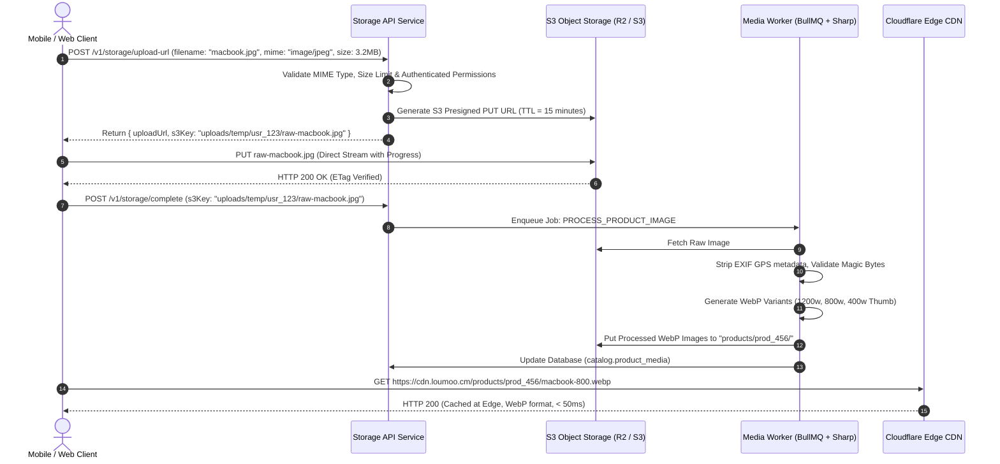

# LOUMOO — Master Media, Object Storage & CDN Architecture

## 1. Storage Architecture Overview

LOUMOO's media architecture relies on **S3-Compatible Object Storage** (Cloudflare R2 or AWS S3) coupled with **Cloudflare Edge CDN** for low-latency asset delivery across Central Africa.

To ensure stability and high throughput on mobile networks, application servers **never stream or buffer raw file uploads**. Instead, all uploads execute via secure **presigned multipart upload URLs** directly between the client and S3.



---

## 2. Storage Bucket Architecture & Permissions

LOUMOO partitions object storage into **three logically separated buckets**:

| Bucket Identifier | Access Level | Encryption | Lifecycle Rule | Contents |
| :--- | :--- | :--- | :--- | :--- |
| `loumoo-public-media` | Public Read (via CDN) | SSE-S3 (AES-256) | Retain permanently | Product photos, store banners, category icons, announcement images |
| `loumoo-private-kyc` | Private (Presigned URLs only)| SSE-KMS (AES-256) | Retain 5 years (Legal compliance)| National ID (CNI), Passports, RCCM certificates, Tax cards |
| `loumoo-audio-chat` | Protected (Authenticated) | SSE-S3 (AES-256) | Auto-delete after 90 days | Voice note audio recordings (`.ogg` / `.m4a`), chat attachments |

---

## 3. Image Optimization & Responsive WebP Pipeline

When a product or store image is uploaded, the background media worker (powered by `libvips` / `Sharp`) automatically generates the following optimized assets:

```typescript
export const PRODUCT_IMAGE_SPECS = [
  { suffix: 'large', width: 1200, height: 900, quality: 82, format: 'webp' },
  { suffix: 'medium', width: 800, height: 600, quality: 80, format: 'webp' },
  { suffix: 'thumbnail', width: 400, height: 300, quality: 78, format: 'webp' },
  { suffix: 'blurhash', generateBlurhash: true }
];
```

### Benefits:
- **Bandwidth Reduction**: Standard 4 MB JPEG photos are compressed into crisp ~120 KB WebP assets without visual degradation.
- **Instant Skeleton Loading**: Computes a 32-character `Blurhash` string stored directly in PostgreSQL to render instant frosted previews before images load.

---

## 4. WhatsApp Voice Note Waveform Processing Pipeline

For voice notes recorded in the WhatsApp discussions view (`is.threadSeller`):
1. **Upload**: Audio is uploaded directly to `loumoo-audio-chat` as `audio/m4a` or `audio/ogg`.
2. **Analysis**: Worker extracts audio duration and samples the amplitude curve into a **25-integer normalized waveform array (0 - 100)**:
   ```json
   {
     "durationSeconds": 5,
     "waveform": [12, 18, 22, 14, 8, 16, 20, 24, 18, 10, 14, 19, 11, 7, 15, 21, 17, 12, 9, 14, 18, 10]
   }
   ```
3. **Frontend Playback**: The frontend renders the dynamic interactive waveform scrubber matching WhatsApp's UI.

---

## 5. Security & Upload Protection Rules
- **Magic-Byte Validation**: Server verifies actual file headers (e.g. `FF D8 FF` for JPEG, `89 50 4E 47` for PNG, `52 49 46 46` for WebP/WAV). Rejects executable files disguised as images.
- **Size Limits**:
  - Product / Announcement Images: Max 10 MB per file.
  - Voice Notes: Max 10 MB (5 minutes max duration).
  - Verification Documents (PDF / CNI): Max 15 MB.
- **EXIF Stripping**: All GPS coordinates, camera serial numbers, and personal metadata are automatically stripped from public images to protect user privacy.
