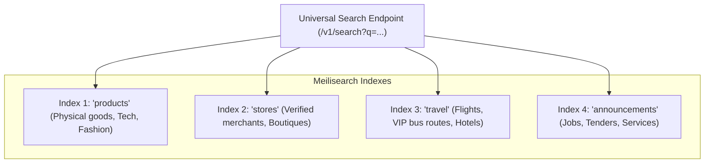

# LOUMOO — Master Search, Discovery & Recommendation Engine Architecture

## 1. Search Engine Evaluation & Architectural Decision

LOUMOO's discovery layer requires **instant, typo-tolerant search across multiple commercial verticals** (MacBooks, Sawa Hotel in Douala, Camair-Co flights, event photographers, and job announcements) in both French and English.

### Comparison Matrix

| Criteria | PostgreSQL Full-Text Search | Elasticsearch / OpenSearch | Meilisearch (Selected) |
| :--- | :--- | :--- | :--- |
| **Response Latency** | 80ms - 250ms | 30ms - 80ms | **< 15ms (C++ Core, In-Memory Index)** |
| **Typo Tolerance** | Requires custom Trigrams / pg_trgm | Complex configuration | **Built-in Damerau-Levenshtein 1-2 typos** |
| **Faceted Filtering** | Slow at high concurrency | Highly capable | **Instant faceted counts (City, Price, Category)** |
| **Operational Overhead** | Low (Built into DB) | High (JVM tuning, cluster memory) | **Low (Single static binary / cluster node)** |
| **Resource Footprint** | Shared with DB CPU | High (Min 4 GB RAM per node) | **Lightweight (~512 MB - 1 GB RAM)** |

**Decision**: We adopt **Meilisearch** as the primary search engine for the discovery tier, backed by PostgreSQL as the immutable data source. PostgreSQL FTS acts as an automatic fallback if the Meilisearch cluster is undergoing maintenance.

---

## 2. Multi-Vertical Search Indexes & Document Schemas

Meilisearch maintains **four primary indexes**:



### 2.1 Products Document Schema (`products` Index)

```json
{
  "id": "prod_macbook_air_m2",
  "title": "MacBook Air M2 13\"",
  "slug": "macbook-air-m2-13",
  "description": "Apple M2 chip, 8GB unified memory, 256GB SSD, Space Grey, 12-month Apple warranty.",
  "category": "Electronics",
  "subCategory": "Laptops",
  "vertical": "PHYSICAL_GOODS",
  "condition": "NEW",
  "priceXaf": 745000,
  "originalPriceXaf": 829000,
  "discountPercent": 10,
  "isFreedayDeal": true,
  "rating": 4.9,
  "reviewsCount": 218,
  "badge": "HOT",
  "sellerId": "sel_orca_electronics",
  "sellerName": "Orca Electronics",
  "sellerTier": "VERIFIED_PRO",
  "city": "Douala",
  "_geo": {
    "lat": 4.0511,
    "lng": 9.7679
  },
  "specs": {
    "chip": "Apple M2",
    "memory": "8 GB",
    "storage": "256 GB SSD",
    "screen": "13.6-inch Liquid Retina"
  },
  "thumbnailUrl": "https://cdn.loumoo.cm/products/macbook-m2-thumb.webp",
  "createdAt": 1788105600
}
```

### 2.2 Search Ranking Rules (Configured in Meilisearch)

```json
[
  "words",
  "typo",
  "proximity",
  "attribute",
  "sort",
  "exactness",
  "isFreedayDeal:desc",
  "rating:desc",
  "reviewsCount:desc"
]
```

---

## 3. Search Filters & Faceting Matrix

The search interface supports multi-dimensional faceted filtering:

| Filter Attribute | Filter Type | Example Query Values | Index Configuration |
| :--- | :--- | :--- | :--- |
| `category` | String Exact | `category = 'Electronics'` | Filterable |
| `city` | String Array | `city IN ['Douala', 'Yaoundé']` | Filterable |
| `priceXaf` | Numeric Range | `priceXaf >= 100000 AND priceXaf <= 800000` | Filterable, Sortable |
| `rating` | Numeric Minimum | `rating >= 4.5` | Filterable, Sortable |
| `condition` | String Exact | `condition = 'NEW'` | Filterable |
| `sellerTier` | String Exact | `sellerTier = 'VERIFIED_PRO'` | Filterable |
| `isFreedayDeal` | Boolean | `isFreedayDeal = true` | Filterable |
| `_geoRadius` | Geospatial | `_geoRadius(4.0511, 9.7679, 10000)` (within 10km)| Filterable, Sortable |

---

## 4. AI Visual Search & Vector Similarity Pipeline

For the camera visual search view (`is.visual`, `is.visualScan`, `is.visualResults`):
1. **Embedding Generation**: User snaps a photo -> Frontend uploads photo -> Server generates a **512-dimension visual embedding vector** using a lightweight MobileNet / CLIP model.
2. **Nearest-Neighbor Lookup**: Executes cosine similarity search against pre-indexed catalog product embeddings.
3. **Results Partitioning**: Returns results categorized into:
   - **Exact Match (`vmTab: exact`)**: High cosine similarity (> 0.92) with identical brand/model.
   - **Similar Items (`vmTab: similar`)**: Broad visual category similarity (> 0.75).

---

## 5. TchueKAM AI Conversational Commerce & RAG Pipeline

The AI chat concierge (`is.threadAi`) provides real-time intelligent recommendations:
1. **User Prompt**: "I have 500,000 XAF and need a laptop for university coding in Douala."
2. **Intent & Extraction**: LLM extracts structured intent:
   - Category: `Laptops`
   - Max Price: `500,000 XAF`
   - Location: `Douala`
   - Use Case: `Software Development`
3. **Retrieval (RAG)**: Backend queries Meilisearch with extracted filters to retrieve top 3 live matching catalog items in stock.
4. **Context Injection & Response**: Feeds retrieved product cards into Google Gemini Flash, generating a natural French/English conversational recommendation with instant buy links.
