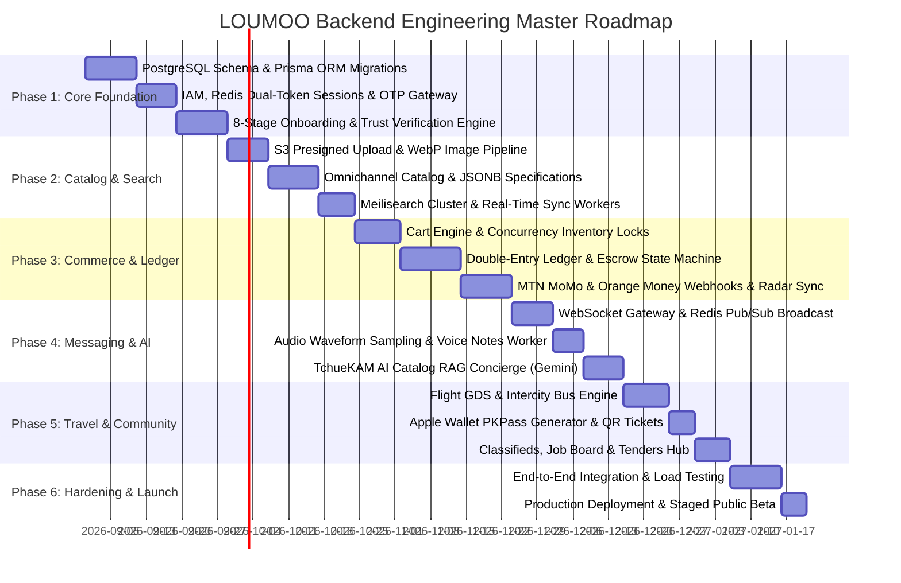

# LOUMOO — Master Engineering Implementation & Migration Roadmap

## 1. Phased Engineering Rollout Strategy

LOUMOO's backend implementation is structured into **6 sequential engineering phases**, designed to deliver value incrementally while keeping the existing frontend completely functional throughout the transition.



---

## 2. Detailed Phase Breakdown & Deliverables

### Phase 1: Foundation, IAM & Onboarding Engine (Weeks 1 – 4)
- **Database**: Initialize PostgreSQL 16 with PostGIS extension, apply Prisma / Drizzle ORM migrations for schemas `iam`, `onboarding`, and `sellers`.
- **Authentication**: Deploy dual-token Ed25519 JWT + Redis sliding session store; integrate SMS/WhatsApp 6-digit OTP gateway.
- **Onboarding Engine**: Connect the 8-stage progressive onboarding frontend wizard to `POST /v1/onboarding/step` with live 85% completion tracking.
- **Verification Portal**: Implement encrypted private S3 storage for CNI, Passport, and RCCM documents.

### Phase 2: Catalog, Media Pipeline & Discovery (Weeks 5 – 7)
- **Object Storage**: Deploy S3 presigned upload endpoint with MIME magic-byte validation and BullMQ Sharp WebP resizing worker.
- **Unified Catalog**: Implement multi-vertical product database supporting physical goods, hotels, universities, and services with JSONB specifications.
- **Search Cluster**: Deploy Meilisearch with Damerau-Levenshtein typo tolerance, faceted filtering by city/price, and PostgreSQL CDC sync.

### Phase 3: Cart, Checkout, Mobile Money & Double-Entry Ledger (Weeks 8 – 11)
- **Cart & Stock**: Implement session/authenticated shopping bag with PostgreSQL row-level pessimistic locking (`SELECT ... FOR UPDATE`) during checkout.
- **Double-Entry Ledger**: Implement immutable ledger tables (`ledger.accounts`, `ledger.journal_entries`, `ledger.entry_lines`) with automated balance validation.
- **Telco Payments**: Integrate MTN Mobile Money (MoMo) collections/disbursements API and Orange Money WebPay API with idempotent webhook verification.
- **Escrow Controller**: Implement automated 48-hour escrow timer releasing funds to seller upon verified delivery.

### Phase 4: Real-Time Messaging & TchueKAM AI Concierge (Weeks 12 – 14)
- **WebSocket Gateway**: Deploy clustered Socket.io / ws gateway backed by Redis Pub/Sub for sub-30ms message delivery.
- **Audio Waveforms**: Implement voice note analyzer extracting 25-integer amplitude arrays for interactive WhatsApp waveforms.
- **TchueKAM AI**: Implement RAG pipeline extracting user shopping intent, querying Meilisearch, and streaming Gemini 1.5 Flash responses.

### Phase 5: Travel, Community Hub & VS Comparison (Weeks 15 – 17)
- **Travel Gateway**: Implement flight schedule lookup (Camair-Co, Air France) and intercity VIP bus bookings (General Express, Touristique Express).
- **Apple Wallet**: Implement digital boarding pass generation producing signed `.pkpass` bundles with QR codes.
- **Community Board**: Implement classifieds, job offers, and tender applications with WhatsApp direct chat links.

### Phase 6: Security Hardening, Load Testing & Launch (Weeks 18 – 20)
- **Performance Benchmarks**: Run K6 load tests simulating 10,000 concurrent shopping sessions and 500 checkout transactions/sec.
- **Security Audit**: Execute OWASP Top 10 penetration testing, rate-limit stress tests, and financial ledger reconciliation audits.
- **Production Rollout**: Deploy zero-downtime rolling updates via Kubernetes / ECS with Cloudflare Anycast CDN routing.

---

## 3. Frontend-to-Backend Migration Strategy (Zero UI Disruption)

To ensure the frontend is **never broken** while the backend is deployed:

1. **Phase 1: Network Adapter Layer (`src/services/api.ts`)**:
   Create a centralized API adapter that inspects `process.env.USE_MOCK_API`:
   ```typescript
   export const apiClient = {
     async getProducts(params) {
       if (USE_MOCK_API) return mockProducts;
       return fetch(`${API_BASE_URL}/v1/products?${new URLSearchParams(params)}`).then(r => r.json());
     }
   };
   ```
2. **Phase 2: Gradual View Wire-Up**:
   Wire views sequentially (Auth -> PDP -> Cart -> Checkout -> Chat -> Travel).
3. **Phase 3: End-to-End Live State**:
   Remove mock fallback flags once all test suites in `verify_runtime.js` execute against the live backend API.
