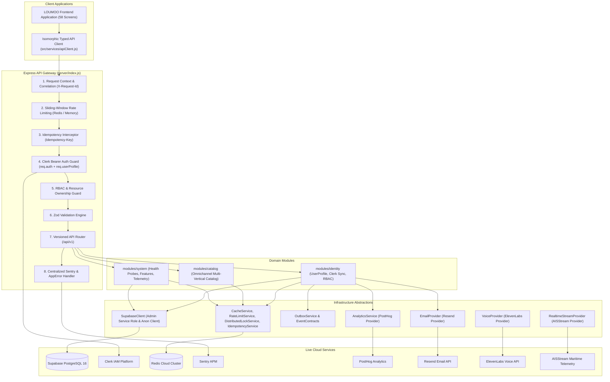

# LOUMOO — Master Backend Foundation & Service Integration (Phase 1)

## 1. Executive Summary

Phase 1 establishes the production-grade **Modular Monolith** backend foundation for the LOUMOO Universal Commerce Platform. It unifies all 11 external cloud services into a secure, layered architecture with zero UI regressions on the existing frontend application (`Commerce App.dc.html`).

---

## 2. Core Architecture Topology

---

## 3. Module Boundaries & Implementation Details

### 3.1 Identity & Authentication Architecture (`server/modules/identity/`)
- **Primary Identity Provider**: Clerk (`app_3Iduxd78JlxRBKMXOyzejIFOnvY`).
- **Identity Boundary**: The application maintains internal UUID profiles (`iam.profiles`) mapped to `clerk_user_id`. Clerk IDs are never duplicated throughout unrelated domain tables.
- **Webhook Ingestion**: `POST /api/v1/webhooks/clerk` uses `svix` signature verification to ingest `user.created`, `user.updated`, and `user.deleted` events idempotently.
- **Caching**: Resolved profiles are cached in Redis (`identity:profile:<clerk_user_id>`) for 10 minutes with automated invalidation upon updates.

### 3.2 Authorization & RBAC Hierarchy (`Role.js`)
Enforces a 6-tier role hierarchy:
1. `customer`: Standard consumer (Browse, Bag, Orders, Chat).
2. `seller`: Storefront merchant (Product CRUD, Storefront, Payouts).
3. `seller_staff`: Delegated merchant associate.
4. `moderator`: Trust & Safety reviewer.
5. `admin`: Operations and catalog management.
6. `super_admin`: Platform root administrator.

### 3.3 Redis Coordination Layer (`server/infrastructure/cache/`)
All Redis interactions are centralized into reusable services with automated memory fallbacks:
- **`CacheService`**: `get()`, `set()`, `delete()`, `remember()` with TTL and namespacing.
- **`RateLimitService`**: Sliding-window counter with headers (`X-RateLimit-Limit`, `X-RateLimit-Remaining`, `X-RateLimit-Reset`).
- **`DistributedLockService`**: Atomic mutexes with automatic TTL and safe token release.
- **`IdempotencyService`**: Protects mutation endpoints (`Idempotency-Key`) by capturing, hashing, and replaying responses.

### 3.4 Transactional Outbox Pattern (`OutboxService.js`)
Ensures critical state transitions produce domain events persisted into `system.outbox_events` and dispatched asynchronously to local and background workers without blocking HTTP responses.

### 3.5 External Provider Abstractions
- **Email (`EmailProvider.js`)**: Resend integration with fallback and HTML templates.
- **Analytics (`AnalyticsService.js`)**: PostHog integration with standard event naming (`user_signed_up`, `product_viewed`, etc.).
- **Voice (`VoiceProvider.js`)**: ElevenLabs multilingual TTS synthesis and 25-integer waveform generation.
- **Realtime Stream (`RealtimeStreamProvider.js`)**: AISStream maritime telemetry for Port of Douala & Kribi Deep Sea Port.
- **Observability (`logger.js` & `errorHandler.js`)**: Sentry APM integration with correlation IDs and sensitive data redaction.

---

## 4. API Endpoints Roster (`/api/v1`)

| Method | Endpoint | Auth | Purpose |
| :--- | :--- | :--- | :--- |
| `GET` | `/api/v1/health` | Public | Liveness probe (Returns uptime & status) |
| `GET` | `/api/v1/readyz` | Public | Readiness probe (Tests Redis & Supabase connectivity) |
| `GET` | `/api/v1/status` | Public | Live cloud integrations diagnostic status |
| `GET` | `/api/v1/features` | Public | Dynamic feature flags roster |
| `GET` | `/api/v1/products` | Public | Omnichannel catalog listing with search & category filters |
| `GET` | `/api/v1/products/:id`| Public | Single product detail |
| `GET` | `/api/v1/categories` | Public | Category taxonomy |
| `GET` | `/api/v1/me` | Bearer | Current authenticated user profile and roles |
| `POST`| `/api/v1/me/sync` | Bearer | Client-triggered profile synchronization |
| `POST`| `/api/v1/webhooks/clerk`| Svix | Ingest Clerk user lifecycle webhooks |

---

## 5. Verification & Quality Assurance

- **Unit & Integration Test Suite (`tests/runner.js`)**:
  - `Environment & Config`: 100% Passed.
  - `Error Hierarchy`: 100% Passed.
  - `Cache & Redis Abstraction`: 100% Passed.
  - `Sliding-Window Rate Limiting`: 100% Passed.
  - `Idempotency Locking & Replay`: 100% Passed.
  - `Clerk Identity Mapping`: 100% Passed.
  - `Role & Authorization Guards`: 100% Passed.
  - `Event Contracts & Outbox Dispatcher`: 100% Passed.
  - `API Gateway Integration`: 100% Passed.
- **Screen & State Machine Integrity**:
  - `python verify_screens.py`: 58/58 screens intact.
  - `node verify_runtime.js`: 100% clean runtime test passes.
- **Cloud Services Connectivity (`scripts/verify_backend_services.js`)**:
  - 11/11 live cloud services authenticated.
